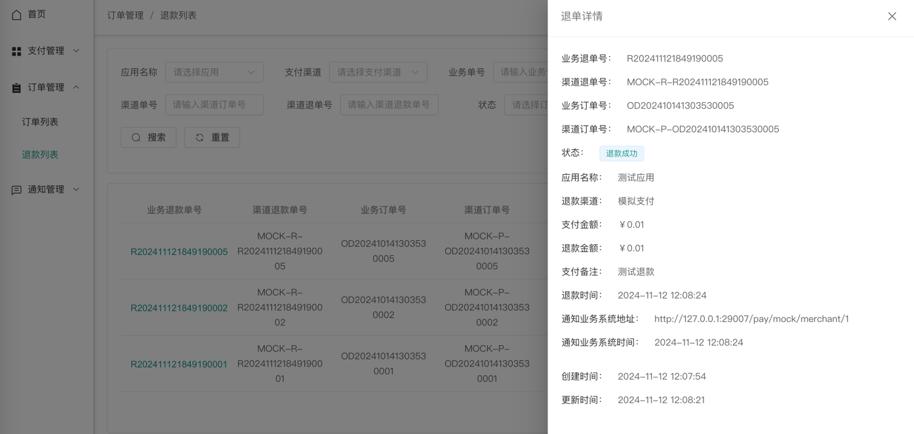

# payment-gateway

本项目主要完成支付网关功能，包含支付应用配置、支付渠道配置、支付订单管理、退款订单管理、业务通知任务管理等功能。

## 项目模块分析
payment-system-api-service  负责启动项目、提供对外接口等  
payment-system-business  业务功能实现  
payment-system-data  数据处理层，使用mybatis-plus实现  
payment-system-ui  web端功能展示，使用 vue3 + typescript + element-plus 实现  

## 页面功能展示

支付应用配置页面：

支付渠道配置页面：

支付订单页面：

详情页面：

退款列表页面：

详情页面：

通知业务系统页面：

## 补充优化建议
1、重要接口已做幂等，需要添加幂等可自行补充；  
2、部分接口已做防重提交，需要做防重可在api接口处添加注解@NotRepeatSubmit即可；  
3、防重设计默认使用local模式，建议开启redis模式，仅需配置@NotRepeatSubmit(type = "redis")即可；  
4、通知业务系统默认使用 redisson 延迟队列，如有需要可直接替换成其他 MQ 组件，直接修改com.payment.mq下代码即可；  
5、框架已集成 rabbitMQ 组件，直接添加 com-spring-boot-starter-rabbitmq 依赖即可；  